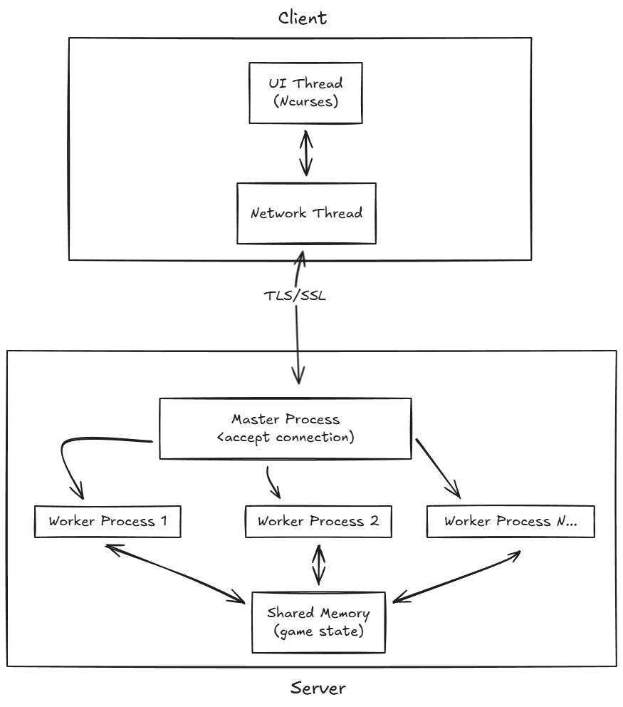
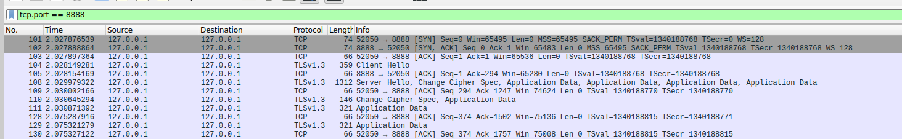

# World Boss Raid - High Concurrency Game System

**World Boss Raid** is a high-concurrency multiplayer online game system developed based on Linux System Programming. This project demonstrates a complete implementation from low-level Socket communication, custom binary protocol, multi-process/multi-thread architecture to IPC (Inter-Process Communication).

The system simulates a scenario where multiple clients simultaneously attack a World Boss, and provides real-time terminal visualization interface through Ncurses.
## Overview



## Key Features

* **High Performance Server**
    * **Master-Worker Multi-Process Architecture** (Process Pool) that effectively utilizes multi-core CPUs.
    * Uses **Shared Memory** to manage World Boss HP and game state, achieving zero-copy data sharing.
    * Implements **Semaphore** mechanism to ensure data consistency and thread safety under concurrent attacks.
* **High Concurrency Client**
    * **Multi-thread (Pthreads)** architecture where a single client program can simulate 100+ concurrent connections for stress testing.
    * **Ncurses TUI Interface**: Real-time rendering of Boss animations, dynamic health bars, and attack effects without affecting transmission performance.
* **Custom Binary Protocol**
    * Independent of HTTP/JSON, self-designed compact **Binary Protocol**.
    * Supports **Checksum integrity verification** to prevent packet corruption.
    * Packet structure includes: Header (Length, OpCode, SeqNum) + Body (Payload Union).
* **Security Features**
    * **TLS/SSL Encryption**: Secure communication using OpenSSL (TLS 1.2+) with certificate verification.
    * **Replay Attack Protection**: Sequence number validation to prevent packet replay attacks.
    * **Rate Limiting**: Sliding window algorithm to prevent DDoS and spam attacks (5 requests/second per connection).
    * **Input Validation**: Comprehensive validation for usernames, OpCodes, and packet sizes.
    * **Checksum Verification**: Integrity check to detect packet corruption and tampering.
    * **Multi-level Logging System**: Configurable log levels (DEBUG, INFO, WARN, ERROR, FATAL) with file/console output support.
* **Fault Tolerance & Stability**
    * Implements **Graceful Shutdown**: Captures SIGQUIT (Ctrl+\) to ensure proper release of IPC resources when the server shuts down (prevents zombie processes).
    * **Keep-Alive/Heartbeat**: Bidirectional monitoring with timeout detection (client sends every 0.5s, server tracks last activity and closes idle connections after 30s).
    * **Connection Timeout**: Server-side timeout detection using select() with 5-second receive timeout.

## Project Structure

```text
WorldBossRaid/
├── CMakeLists.txt          # CMake build configuration
├── README.md               # Project documentation
├── image/                  # Project images and screenshots
│   ├── overview.png        # System overview diagram
│   └── packet.png          # Wireshark packet capture example
├── scriptt/                # Test scripts for Security & Reliability verification
│   ├── heartbeat/          # Heartbeat mechanism test
│   │   └── test_heartbeat.sh
│   └── graceful_shotdown/  # Graceful shutdown test
│       └── test_shutdown.sh
├── src/
│   ├── common/             # [Common Layer] Protocol & Utilities
│   │   ├── protocol.h     # Packet structure, OpCode, Payload definitions
│   │   ├── tls.h          # TLS/SSL wrapper functions
│   │   ├── tls.c          # TLS/SSL implementation
│   │   ├── log.h          # Multi-level logging system
│   │   ├── log.c          # Logging implementation
│   │   └── log_example.c  # Logging usage examples
│   │
│   ├── server/            # [Server Side]
│   │   ├── server.c       # Entry point, Socket initialization, Master-Worker management
│   │   ├── logic/         # [Business Logic Layer]
│   │   │   ├── client_handler.h
│   │   │   ├── client_handler.c  # Client connection handler with heartbeat timeout
│   │   │   ├── gamestate.h
│   │   │   ├── gamestate.c       # IPC management (Shared Memory creation/destruction)
│   │   │   ├── dice.h
│   │   │   └── dice.c            # Damage calculation & probability logic
│   │   └── security/      # [Security Layer]
│   │       ├── replay_protection.h
│   │       ├── replay_protection.c  # Replay attack protection
│   │       ├── rate_limiter.h
│   │       ├── rate_limiter.c      # Rate limiting for DDoS protection
│   │       ├── input_validator.h
│   │       └── input_validator.c   # Input validation
│   │
│   └── client/            # [Client Side]
│       ├── client.c       # Connection establishment, packet I/O, multi-thread architecture
│       └── ui/            # [UI Layer]
│           ├── client_ui.c    # Main game UI loop with Ncurses
│           ├── client_ui.h
│           ├── login.c        # Login screen
│           ├── login.h
│           ├── bonus.c        # Critical hit animation
│           ├── bonus.h
│           ├── god.c          # Lucky kill animation
│           ├── god.h
│           ├── end.c          # Victory screen
│           └── end_ui.h
```

## Build & Run

### Prerequisites

* Linux Environment (Ubuntu/Debian/CentOS)
* GCC Compiler
* CMake (3.10 or higher)
* OpenSSL Development Libraries
* Ncurses Library
* pthread (usually included in glibc)

```bash
# Ubuntu/Debian
sudo apt-get install build-essential cmake libssl-dev libncurses5-dev libncursesw5-dev

# CentOS/RHEL
sudo yum install gcc cmake openssl-devel ncurses-devel

# Fedora
sudo dnf install gcc cmake openssl-devel ncurses-devel
```

### Compilation

The project uses CMake for building. Create a build directory and compile:

```bash
mkdir build
cd build
cmake ..
make
```

After successful compilation, two executables will be generated: `server` and `client`.

### Usage

1. **Start the Server**

```bash
cd build
./server
# Server will start on port 8888 and create a Worker Pool waiting for connections
```

2. **Start the Client**

```bash
cd build
./client
# Launches Ncurses interface, automatically connects and starts attacking
```

3. **Stress Test Mode**

```bash
cd build
./client --stress
# Launches 100 concurrent worker threads, each sending 20 attacks
# Useful for testing server performance and rate limiting
```

4. **Clean Build Files**

```bash
cd build
make clean
# Or remove the entire build directory:
rm -rf build
```

## Testing Scripts

The project includes automated test scripts to verify Security & Reliability features. All test scripts are located in the `scriptt/` directory.

### Prerequisites

Before running test scripts, ensure:
- The project has been compiled (`make` in `build/` directory)
- Port 8888 is not occupied by other processes
- You have execute permissions for the scripts

### Available Test Scripts

#### 1. Heartbeat Test (`scriptt/heartbeat/test_heartbeat.sh`)

Tests the Keep-Alive/Heartbeat mechanism:

```bash
cd scriptt/heartbeat
./test_heartbeat.sh
```

**What it does:**
- Starts the server in the background
- Launches a client that sends heartbeats every 0.5 seconds
- Runs for 10 seconds to verify heartbeat functionality
- Checks server logs for heartbeat messages
- Automatically cleans up old processes and log files

**Expected output:**
- ✅ Heartbeat is working (if heartbeats are detected in logs)
- ⚠️ No heartbeat detected (if no heartbeats found)

#### 2. Graceful Shutdown Test (`scriptt/graceful_shotdown/test_shutdown.sh`)

Tests the graceful shutdown mechanism:

```bash
cd scriptt/graceful_shotdown
./test_shutdown.sh
```

**What it does:**
- Starts the server in the background
- Checks shared memory status before shutdown
- Sends SIGQUIT signal to the server (simulating Ctrl+\)
- Verifies that shared memory is properly cleaned up
- Checks server logs for shutdown messages
- Automatically cleans up old processes and log files

**Expected output:**
- ✅ Graceful shutdown detected (if shutdown messages found in logs)
- Shows shared memory status before and after shutdown

### Test Script Features

All test scripts include:
- **Automatic Process Cleanup**: Checks for existing server processes on port 8888 and terminates them before starting new tests
- **Log File Management**: Automatically removes old log files (`server.log`, `client.log`) before each test
- **Error Handling**: Gracefully handles test failures and cleanup
- **Path Independence**: Scripts can be run from any directory (they use relative paths to find executables)

### Running All Tests

To run all available tests:

```bash
# Test heartbeat mechanism
cd scriptt/heartbeat && ./test_heartbeat.sh

# Test graceful shutdown
cd scriptt/graceful_shotdown && ./test_shutdown.sh
```

### Test Results

Test results are saved in log files:
- `server.log`: Server-side logs during the test
- `client.log`: Client-side logs during the test

You can review these logs to verify the functionality of each feature.

## Protocol Specification

Communication uses a fixed Header length + variable Body design:

| Byte Offset | Field | Type | Description |
|------------|-------|------|-------------|
| 0-3 | Length | uint32_t | Total packet length (Header + Body) |
| 4-5 | OpCode | uint16_t | Operation code (e.g., 0x11 Attack) |
| 6-7 | Checksum | uint16_t | Simple checksum |
| 8-11 | SeqNum | uint32_t | Packet sequence number |
| 12+ | Body | Union | Payload structure determined by OpCode |

### Main OpCodes

**Client -> Server:**
* `OP_JOIN (0x10)`: Player join request
* `OP_ATTACK (0x11)`: Attack request (includes damage value)
* `OP_LEAVE (0x12)`: Leave game request
* `OP_HEARTBEAT (0x13)`: Keep-alive heartbeat (sent every 0.5s)

**Server -> Client:**
* `OP_JOIN_RESP (0x20)`: Join response with player_id
* `OP_GAME_STATE (0x21)`: Broadcast Boss current HP and game state
* `OP_ERROR (0x22)`: Error message

## Security

* **TLS/SSL Encryption**: All communication is encrypted using TLS 1.2+ with server certificate verification.
* **Replay Attack Protection**: Sequence number validation prevents replaying old packets.
* **Rate Limiting**: Sliding window algorithm limits requests to 5 per second per connection to prevent DDoS attacks.
* **Input Validation**: Comprehensive validation for usernames, OpCodes, and packet sizes to prevent protocol attacks.
* **Checksum Verification**: Each packet includes a checksum to detect corruption and tampering.
* **Certificate-based Authentication**: Server uses X.509 certificates for identity verification.


## Logging

The project includes a multi-level logging system with the following features:

* **Log Levels**: DEBUG, INFO, WARN, ERROR, FATAL
* **Output Options**: Console (stderr) or file
* **Automatic Timestamps**: Each log entry includes timestamp, file, line, and function name
* **Color Support**: ANSI color codes for terminal output (automatically disabled for file output)

Example usage:
```c
#include "common/log.h"

log_init(LOG_INFO, NULL);  // Initialize with INFO level, output to stderr
LOG_INFO("Server started on port %d", PORT);
LOG_ERROR("Failed to bind socket: %s", strerror(errno));
log_cleanup();
```

## Architecture

### Server Architecture

* **Master-Worker Multi-Process**: Master process accepts connections and forks worker processes for each client
* **Worker Processes**: Each worker process handles one client connection independently using TLS
* **Shared Memory**: Game state (Boss HP, player count) shared across all workers via IPC
* **Mutex Protection**: Ensures thread-safe access to shared game state
* **Security Layer**: Each worker implements replay protection, rate limiting, and input validation
* **Heartbeat Monitoring**: Server tracks last heartbeat time and closes idle connections after 30 seconds

### Client Architecture

* **Multi-Thread Architecture**: 
  * **UI Thread** (Main Thread): Manages Ncurses interface rendering
  * **Network Thread**: Handles all network I/O and game state synchronization
* **Thread Synchronization**: Uses `pthread_mutex` and `pthread_cond` for safe data sharing
* **TLS Connection**: Secure encrypted communication with the server
* **Heartbeat Mechanism**: Network thread sends heartbeat every 0.5 seconds to maintain connection

### Communication Flow

1. **Connection**: Client establishes TCP connection, performs TLS handshake
2. **Join**: Client sends `OP_JOIN`, server responds with `OP_JOIN_RESP` and player_id
3. **Game Loop**: 
   - Client sends `OP_ATTACK` or `OP_HEARTBEAT` every 0.5s
   - Server processes requests with security checks (rate limiting, input validation)
   - Server responds with `OP_GAME_STATE` containing latest game state
4. **Disconnection**: Client sends `OP_LEAVE` or server detects timeout and closes connection

#### Packet Capture Example

The following Wireshark capture shows the TLS handshake and initial application data exchange:



**Key Observations:**
- **Packets 101-103**: TCP three-way handshake (SYN, SYN-ACK, ACK)
- **Packets 104-109**: TLSv1.3 handshake (Client Hello, Server Hello, Change Cipher Spec)
- **Packet 110**: First Application Data (contains `OP_JOIN` packet) - sent by main thread after TLS handshake
- **Packet 111**: Second Application Data (contains `OP_HEARTBEAT` packet) - sent immediately by Network Thread to initialize game state

This demonstrates the multi-threaded client architecture where the main thread sends `OP_JOIN` and the Network Thread immediately sends `OP_HEARTBEAT` to synchronize game state. All application data is encrypted via TLS, ensuring secure communication.


### Team Contribution

1. 林威立：Server connection, security and reliability processing 
2. 陳柏傑：Boss logic, overall game status, dice logic
3. 余振言：Client connection and Thread
4. 劉堯欽：Client UI 

## License

This project is for educational purposes, demonstrating Linux system programming concepts.

